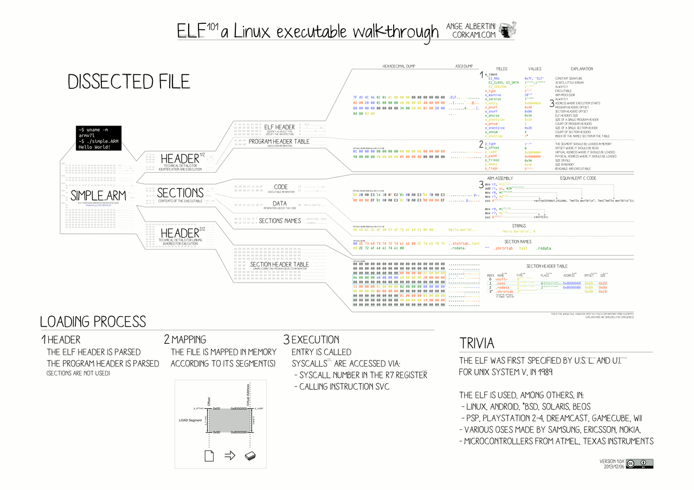

# creating an elf file for running a bash with root privileges

understanding elf : https://cirosantilli.com/elf-hello-world



### using python 

```
import os
print("impersonating as ", os.system('whoami'))
os.system('/bin/bash')

```

Then using pyinstaller

```
pyinstaller --exclude-module _bootlocale --onefile
```

### using c program

http://www.kernel-panic.it/security/shellcode/shellcode5.html


