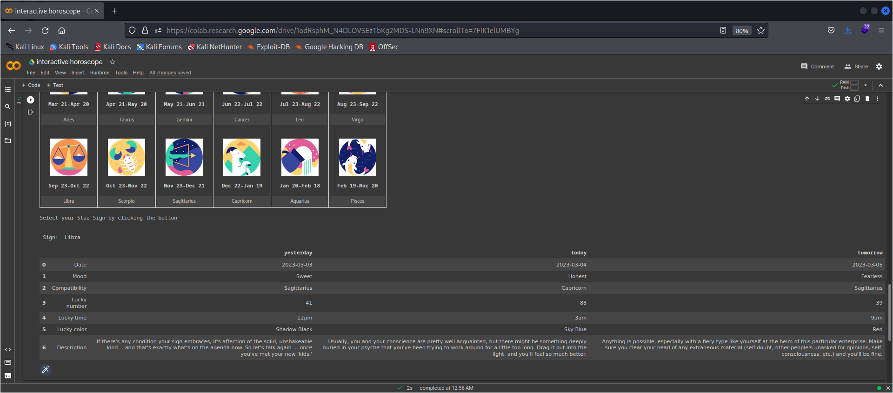

https://quickdraw.readthedocs.io/en/latest/

### pyaztro

creative interactive app in python 
https://towardsdatascience.com/create-interactive-tools-in-google-colab-using-widgets-8a1a504d3b7e

https://colab.research.google.com/drive/1odRsphM_N4DLOVSEzTbKg2MDS-LNn9XN -> pyastro

### quickdraw implementation

https://github.com/akshaybahadur21/QuickDraw

implementation

https://colab.research.google.com/drive/1KF2DkEEtymTVxvcJ3QM6AQi2KK981pUb#scrollTo=USRK5-qIDOWh

trying to create a drawing of fpython notebook at 

