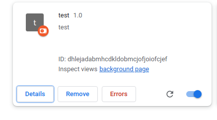

## trying extension1 

first following from : https://www.freecodecamp.org/news/how-to-create-and-publish-a-chrome-extension-in-20-minutes-6dc8395d7153/

is more theoretical

## trying ot build for chrome

trying from : https://www.sitepoint.com/create-chrome-extension-10-minutes-flat/

## trying to build for firefox

https://developer.mozilla.org/en-US/docs/Mozilla/Add-ons/WebExtensions/Your_first_WebExtension

to add extensions in firefox use: about:debugging#/runtime/this-firefox

unable to work it for some reason

another helpful link

https://developer.mozilla.org/en-US/docs/Mozilla/Add-ons/WebExtensions/Your_second_WebExtension

### buiding for google

https://medium.com/@ConnorFinnegan/how-to-make-a-simple-text-replacement-chrome-extension-3e7aa9fa301f

## Make it bold

made an extension to make it bold

