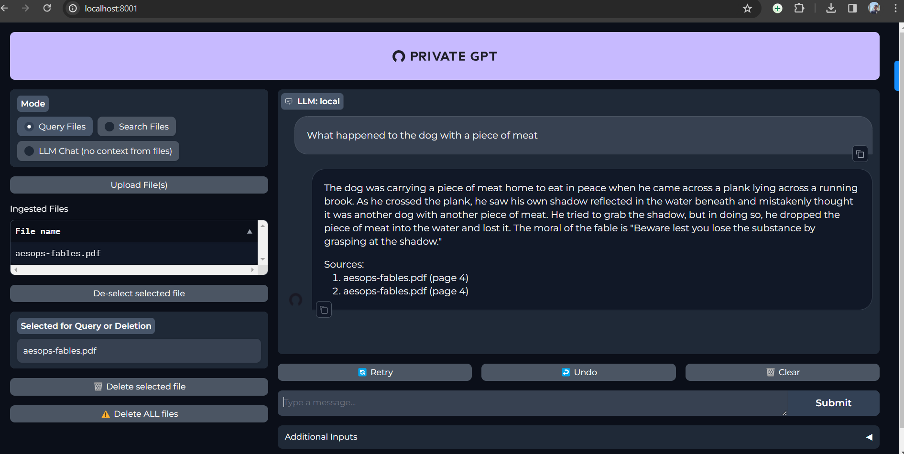

https://github.com/mlc-ai/web-llm

https://dev.to/codepo8/privategpt-running-chatgpt-offline-on-local-documents-5b17

I downloaded the llm and privategpt

privategpt had issues installing poetry. went ahead with llm sudio.

llm studio works, but how to add new documents?

tring ollama for windows

install olam from ollama.com

https://github.com/PromptEngineer48/Ollama.git

this works.

need to create an ui

prvate gpt works, while installing poetry we need to setup environment variables as well

bit is slow, cant take big documents

https://medium.com/data-and-beyond/run-privategpt-on-windows-bf64fe2a02b8

bad performance

