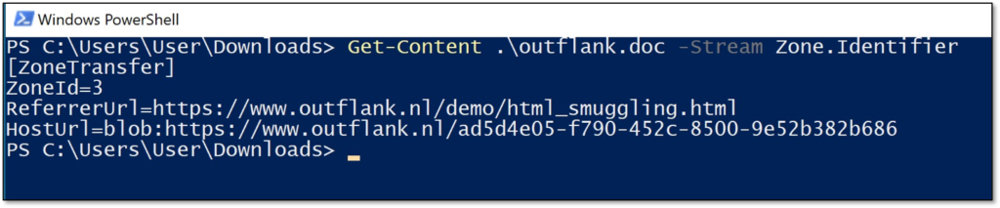
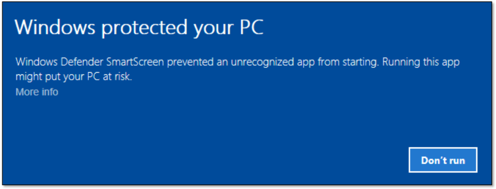
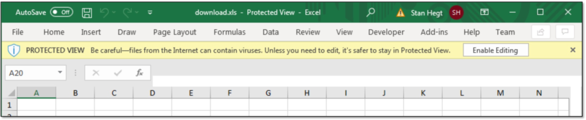

from https://medium.com/sse-blog/offphish-phishing-revisited-in-2023-32f84ed65cc9

## Types of phishing documents

    Microsoft Office documents (like Word, Excel, PowerPoint, OneNote, Publisher, …)
    PDFs
    HTML files
    Self-executing files (PE-Files, batch-files)
    Special-purpose files with a specific execution strategy, such as .lnk-, .html-, .js-, .wsh-, .hh-files and others

Outbound and inbound  mail filters

### outbound filters

    For example you might not be allowed to send a 50mb file on a free GMail account, your files might be scanned for malicious content before being allowed to be sent and you will likely be rate-limited when sending mails.

### inbound filters

    Spam filters: All major mail gateways try to identify spam-mails based on different criteria, such as reputation of the sending domain or presence of certain words or phrases. @mariuszbit brought up a tool to identify such policies, which can be found here.
    SPF & DMARC checks: If you don’t pretend to be someone else, e.g. you’re not trying to spoof the SMTP “FROM”-Header, saying that you’re the CEO sending a mail, then SPF and DMARC checks should not be a blocker for you. Nevertheless one should know these exists (once again I will not drill down on this to focus on the bigger picture).
    
    Region exclusions: Some mail providers (like Outlook), also support to block mails originating from manually chosen countries.
    Anti-virus scans: Your mail might be scanned for malicious content before being delivered to a user’s inbox, especially if the mail contains an executable attachment. These scans could be simple static analysis scans, as well as sandboxed behavior scans.
    
    Provider specific protections: For example if you target a Microsoft 365 environment, then it should be noted that these per default include Microsoft’s Exchange Online Protection-Feature set, which per default brings customizable Anti-Phishing, Anti-Spam and Anti-Malware policies. Moreover Microsoft customers that paid extra could also benefit from Safe Attachments and Safe Links-Policies. For our topic most notably in this category is that the default Anti-Malware-Policy that comes with EOP (Exchange Online Protection) contains a setting called “Common attachment filter”, which — when enabled — filters attachments based on their extensions. This “Common attachment filter” is switched off by default (hint: If you’re a defender you might want to enable this). If enabled, the following extension are blocked by default (can also manually be extended): ace, apk, app, appx, ani, arj, bat, cab, cmd,com, deb, dex, dll, docm, elf, exe, hta, img, iso, jar, jnlp, kext, lha, lib,library, lnk, lzh, macho, msc, msi, msix, msp, mst, pif, ppa, ppam, reg,rev, scf, scr, sct, sys, uif, vb, vbe, vbs, vxd, wsc, wsf, wsh, xll, xz, z

### decoding spam headers

This tool accepts on input an *.EML or *.txt file with all the SMTP headers. It will then extract a subset of interesting headers and using 105+ tests will attempt to decode them as much as possible.

https://github.com/mgeeky/decode-spam-headers

In order to embellish your Phishing HTML code before sending it to your client, you might also want feed it into my phishing-HTML-linter.py. It does pretty decent job finding bad smells in your HTML that will get your e-mail with increased Spam-score.

https://github.com/mgeeky/Penetration-Testing-Tools/blob/master/phishing/phishing-HTML-linter.py

### Reception and unboxing

    The targeted user
    Mark of the web (MOTW)
    Anti-Virus (AV) solutions in place

### Tricking the User

First of all you want your targeted user to actually open the mail and the attachment (remember there are also other forms of mail phishing, e.g. using links, but this post focuses on Microsoft Office attachments). Therefore, your pretext should match with the attachment type (e.g. sending a OneNote document to a technical user stating that this is an invoice could raise suspicion). The variety of Microsoft Office file extensions play in your favor here, for example one could abuse the fact that.XLL files (more on this later) do look like Excel (.xls or .xlsx) documents. Moreover Right-to-Left override-techniques might come in handy for certain scenario

Right to left override:
https://attack.mitre.org/techniques/T1036/002/

### Bypassing MOTW

The Mark of the web (MOTW) is not exactly brand new, therefore I will skip the intro to MOTW, but if you have not encountered it yet, I can recommend Outflank’s blog post on the topic: 

https://outflank.nl/blog/2020/03/30/mark-of-the-web-from-a-red-teams-perspective/.

Your payload in the format of an executable, MS Office file or CHM file is likely to receive extra scrutiny from the Windows OS and security products when that file is marked as downloaded from the internet. In this blog post we will explain how this mechanism works and we will explore offensive techniques that can help evade or get rid of MOTW.

Mark-of-the-Web (MOTW) is a security feature originally introduced by Internet Explorer to force saved webpages to run in the security zone of the location the page was saved from. Back in the days, this was achieved by adding an HTML comment in the form of <!-–saved from url=> at the beginning of a saved web page.

This mechanism was later extended to other file types than HTML. This was achieved by creating an alternate data stream (ADS) for downloaded files. ADS is an NTFS file system feature that was added as early as Windows 3.1. This feature allows for more than one data stream to be associated with a filename, using the format “filename:streamname”.

When downloading a file, Internet Explorer creates an ADS named Zone.Identifier and adds a ZoneId to this stream in order to indicate from which zone the file originates. Although it is not an official name, many people still refer to this functionality as Mark-of-the-Web.

The following ZoneId values may be used in a Zone.Identifier ADS:

    0. Local computer
    1. Local intranet
    2. Trusted sites
    3. Internet
    4. Restricted sites

### MOTW on documents:

### how to avoid motw

Strategy 1: abusing software that does not set MOTW

The first strategy is to deliver your payload via software that does not set (or propagate) the MOTW attribute.

A good example of this is the Git client. The following picture shows that a file cloned from GitHub with the Git client does not have a Zone.Identifier ADS.

