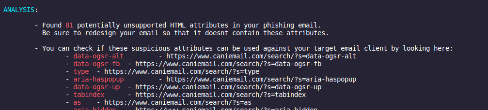

from https://medium.com/sse-blog/offphish-phishing-revisited-in-2023-32f84ed65cc9

## Types of phishing documents

    Microsoft Office documents (like Word, Excel, PowerPoint, OneNote, Publisher, …)
    PDFs
    HTML files
    Self-executing files (PE-Files, batch-files)
    Special-purpose files with a specific execution strategy, such as .lnk-, .html-, .js-, .wsh-, .hh-files and others

Outbound and inbound  mail filters

### outbound filters

    For example you might not be allowed to send a 50mb file on a free GMail account, your files might be scanned for malicious content before being allowed to be sent and you will likely be rate-limited when sending mails.

### inbound filters

    Spam filters: All major mail gateways try to identify spam-mails based on different criteria, such as reputation of the sending domain or presence of certain words or phrases. @mariuszbit brought up a tool to identify such policies, which can be found here.
    SPF & DMARC checks: If you don’t pretend to be someone else, e.g. you’re not trying to spoof the SMTP “FROM”-Header, saying that you’re the CEO sending a mail, then SPF and DMARC checks should not be a blocker for you. Nevertheless one should know these exists (once again I will not drill down on this to focus on the bigger picture).
    
    Region exclusions: Some mail providers (like Outlook), also support to block mails originating from manually chosen countries.
    Anti-virus scans: Your mail might be scanned for malicious content before being delivered to a user’s inbox, especially if the mail contains an executable attachment. These scans could be simple static analysis scans, as well as sandboxed behavior scans.
    
    Provider specific protections: For example if you target a Microsoft 365 environment, then it should be noted that these per default include Microsoft’s Exchange Online Protection-Feature set, which per default brings customizable Anti-Phishing, Anti-Spam and Anti-Malware policies. Moreover Microsoft customers that paid extra could also benefit from Safe Attachments and Safe Links-Policies. For our topic most notably in this category is that the default Anti-Malware-Policy that comes with EOP (Exchange Online Protection) contains a setting called “Common attachment filter”, which — when enabled — filters attachments based on their extensions. This “Common attachment filter” is switched off by default (hint: If you’re a defender you might want to enable this). If enabled, the following extension are blocked by default (can also manually be extended): ace, apk, app, appx, ani, arj, bat, cab, cmd,com, deb, dex, dll, docm, elf, exe, hta, img, iso, jar, jnlp, kext, lha, lib,library, lnk, lzh, macho, msc, msi, msix, msp, mst, pif, ppa, ppam, reg,rev, scf, scr, sct, sys, uif, vb, vbe, vbs, vxd, wsc, wsf, wsh, xll, xz, z

### decoding spam headers

This tool accepts on input an *.EML or *.txt file with all the SMTP headers. It will then extract a subset of interesting headers and using 105+ tests will attempt to decode them as much as possible.

https://github.com/mgeeky/decode-spam-headers

In order to embellish your Phishing HTML code before sending it to your client, you might also want feed it into my phishing-HTML-linter.py. It does pretty decent job finding bad smells in your HTML that will get your e-mail with increased Spam-score.

https://github.com/mgeeky/Penetration-Testing-Tools/blob/master/phishing/phishing-HTML-linter.py

### Reception and unboxing

    The targeted user
    Mark of the web (MOTW)
    Anti-Virus (AV) solutions in place

### Tricking the User

First of all you want your targeted user to actually open the mail and the attachment (remember there are also other forms of mail phishing, e.g. using links, but this post focuses on Microsoft Office attachments). Therefore, your pretext should match with the attachment type (e.g. sending a OneNote document to a technical user stating that this is an invoice could raise suspicion). The variety of Microsoft Office file extensions play in your favor here, for example one could abuse the fact that.XLL files (more on this later) do look like Excel (.xls or .xlsx) documents. Moreover Right-to-Left override-techniques might come in handy for certain scenario

### Right to left override:

https://attack.mitre.org/techniques/T1036/002/

https://www.exandroid.dev/2022/03/21/initial-access-right-to-left-override-t1036002/

https://github.com/ExAndroidDev/rtlo-attack

### Bypassing MOTW

The Mark of the web (MOTW) is not exactly brand new, therefore I will skip the intro to MOTW, but if you have not encountered it yet, I can recommend Outflank’s blog post on the topic: 

https://outflank.nl/blog/2020/03/30/mark-of-the-web-from-a-red-teams-perspective/.

Your payload in the format of an executable, MS Office file or CHM file is likely to receive extra scrutiny from the Windows OS and security products when that file is marked as downloaded from the internet. In this blog post we will explain how this mechanism works and we will explore offensive techniques that can help evade or get rid of MOTW.

Mark-of-the-Web (MOTW) is a security feature originally introduced by Internet Explorer to force saved webpages to run in the security zone of the location the page was saved from. Back in the days, this was achieved by adding an HTML comment in the form of <!-–saved from url=> at the beginning of a saved web page.

This mechanism was later extended to other file types than HTML. This was achieved by creating an alternate data stream (ADS) for downloaded files. ADS is an NTFS file system feature that was added as early as Windows 3.1. This feature allows for more than one data stream to be associated with a filename, using the format “filename:streamname”.

When downloading a file, Internet Explorer creates an ADS named Zone.Identifier and adds a ZoneId to this stream in order to indicate from which zone the file originates. Although it is not an official name, many people still refer to this functionality as Mark-of-the-Web.

The following ZoneId values may be used in a Zone.Identifier ADS:

    0. Local computer
    1. Local intranet
    2. Trusted sites
    3. Internet
    4. Restricted sites

### MOTW on documents:

### how to avoid motw

Strategy 1: abusing software that does not set MOTW

The first strategy is to deliver your payload via software that does not set (or propagate) the MOTW attribute.

A good example of this is the Git client. The following picture shows that a file cloned from GitHub with the Git client does not have a Zone.Identifier ADS.

    Utilizing software that does not set the MOTW (e.g. git)
    Using containers, where Windows does not propagate the MOTW to files inside the container (e.g. .7z, .cab, ...)
    Tricking the user to remove the MOTW by right clicking on the file, choosing “Properties” from the context menu and check the box that says “unblock”

tools that support mark of the web
https://github.com/nmantani/archiver-MOTW-support-comparison

7z is capable to propagate the MOTW when extracting files, but it depends on how 7z is used. When a file is opened within the 7z UI, e.g. when double clicking the file, then the MOTW is propagated and macros are blocked. However, when a user right clicks the compressed 7z archive, selects to extract the file in the context menu and then opens the file, the MOTW is not propagated and macros can execute.

### withstand AV scanning

Payload design: When developing code for your campaign always try to keep a small footprint and evaluate your “detection” footprint when adding code. For example: You could consider implementing an AMSI bypass attempt in your VBA macro code, but if you can’t bring a custom, unknown technique the cost of this will likely not be worth the gain.

file pumping: These techniques describe the idea to stuff benign content into a file to lower their detection rate. The idea of this is to evade or pass AV scans, based on the observation that some AVs skip files of certain size for performance reasons or lower the detection rate of malicious content if the frequency of “common document content” is high enough.

Obfuscation: Standard, don’t make detection rates using static analysis too easy.

Encryption: Note that we should differentiate between container and payload encryption in our campaign. We could use encryption within the container that carries our document, e.g. we could use encrypted ZIP archives, or encrypted Word/Excel/PowerPoint/X documents (which I refer to as container encryption) and we could encrypt our embedded payload(s), e.g. encrypted Shellcode, strings, or code elements (which I refer to as payload encryption).

Container Encryption: While encrypting our container does help a lot against AV detection, it comes with two drawbacks that should be considered. First drawback: The en-/decryption must fit your campaign. Meaning if you encrypt your Office document with a custom password, you have to convince your target that there is a legit reason that a password must be entered. Also keep in mind that encrypting your document will not evade the MOTW. Therefore, if you run a campaign where your target has to extract your document from an unusual container type (to bypass MOTW), only to find out that they now also have to enter a password, might tip them off. Could be a pitfall, doesn’t have to be. Second drawback: Detection footprint. Some mail gateways will not allow encrypted ZIPs in the first place (which would return you to stage 1) and just being encrypted might raise the AV score of your document (again don’t read this as “you should not use encryption”, read it as “consider the costs of encryption”). Extra note: Some Office applications (Excel & PowerPoint) have a “common default password” that will decrypt a document on the fly without showing a prompt. In Excel the password VelvetSweatshop can be used (supported by all Excel formats), in PowerPoint /01Hannes Ruescher/01 (thanks to this tweet) can be used, but this only works with the .pps and .ppt format.

payload encryption: Analogous to what I’ve said before, consider the costs of this. There is no user interaction here, so these costs do not apply, but there is also a detection footprint here. Consider where the decryption key is obtained from (file on disk, environment variable, pulled from webserver, volatile properties like current time, …) and what is needed for the decryption routine, e.g. are you using Win32 API functions? If yes, could these be hooked? Often times (depending on how custom your payload is) dynamic en-/decryption is very well worth the costs.

VBA Stomping & VBA Purging: https://github.com/mgeeky/OfficePurge/

AV/Sandbox detection routines: https://github.com/mgeeky/Penetration-Testing-Tools/blob/master/phishing/MacroDetectSandbox.vbs

AV evasion: Consider what your document/implant is supposed to do (see “goals in the Execution section”), weigh that against static and “behavior” analysis capabilities of AV/EDR/XDRs of your targeted environment and apply your favorite evasion techniques. If your document contains malicious content that you want to hide from AVs you could consider sandbox evasion techniques that require human interaction, like clicking/accepting a message box or special triggers (see also the section about “triggers” in the following Execution stage) like hovering over an image before your exploit routine starts. If your document has a rather low footprint, but you’re looking for evasion techniques for an implant that you plan to download/drop/execute, you could look into techniques like anti-hooking, PPID spoofing, dynamic/sleep obfuscation, spawning of remote process, etc. Need more ideas? Get inspiration from this talk by @mariuszbit.

    Commonly abused containers like .iso,.img,.cab are (currently) filtered by Outlook's inbound mail gateway and flagged by the Windows defender right away. At least in my off-the-shelf default Microsoft 365 playground.
    
    VBA Stomping appears (to me) not to be too fruitful any longer, as it’s well detected.
    
    When it comes to detection rates file formats can play a big role. I put a simple shellcode loader (Download + VirtualAlloc + CreateThread) into a VBA macro inside of an encrypted office document (Word & Excel) and found that the XML-based Office formats (e.g. .docm, .dotm) were not flag (0 detections), whereas the corresponding compound files (.doc, .dot) were flagged by multiple vendors (see the VirusTotal benchmark at the end of this post).

Execution:  There is always more than one way to achieve your goal, although not every technique might be suitable for every goal.
[For brevity I’ll skip implementation/execution details, but will link articles covering these]

    VBA macro https://www.ired.team/offensive-security/initial-access/phishing-with-ms-office/t1137-office-vba-macros
    XLM macro ([8][9][10][11]) https://vblocalhost.com/uploads/VB2020-61.pdf
    DDE ([12][13][14])
    Field codes ([15][16])
    Embedded files (attachments & OLE elements)
    Add-Ins (XLL [17][18][19][20], VSTO [21][22][23])
    Lazy-loaded components & external references (template injection [24][25][26], CVE-2022–30190 aka Follina [27][28], CustomUI [29])

# New Techniques

1. right ot left override
2. spam filter
3. inbound vs outbound mails
4. MOTW

